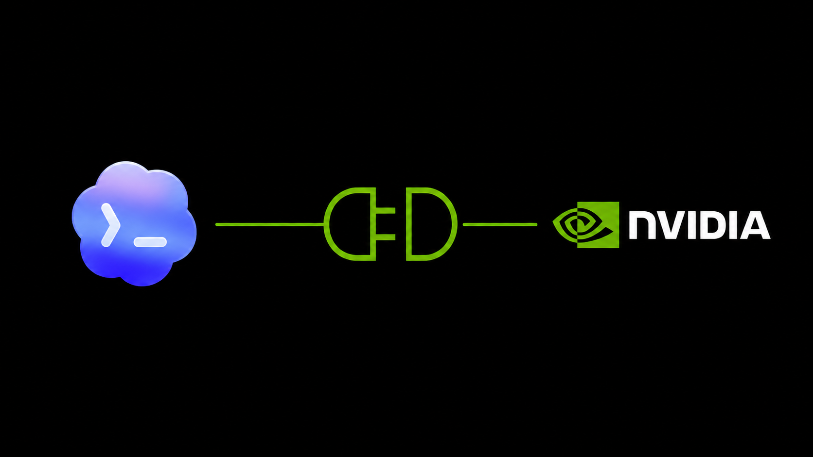

# NVIDIA RTX/DLSS Codex Plugin

[](https://github.com/Cameloo1/nvidia-dev-codex-plugin/actions/workflows/ci.yml)
[](https://github.com/Cameloo1/nvidia-dev-codex-plugin/tags)




**Not affiliated with, endorsed by, or sponsored by NVIDIA.** NVIDIA, RTX, DLSS, CUDA, Nsight, NVENC, NVDEC, and related names are trademarks or registered trademarks of NVIDIA Corporation.

`nvidia-rtx-dlss` is a release-candidate Codex plugin for NVIDIA-focused content technology work. It helps Codex classify projects, choose the right NVIDIA SDK route, inspect local SDK headers, plan integrations, generate safe scaffolds, validate locally, and prepare release-quality reports without crossing NVIDIA licensing or privacy boundaries.

## What It Does

- Routes goals to the correct NVIDIA stack: Streamline/DLSS, RTX Video SDK, Video Codec SDK, Optical Flow SDK, Reflex, Nsight, RTX Kit, Unreal, Unity, or web/native boundaries.
- Produces source-backed compatibility, integration, patch, validation, and rollback plans.
- Generates narrow scaffold files only when explicitly approved.
- Runs local validation automation for environment reports, logs, harness planning, codec throughput, and quality comparison.
- Inspects local SDK headers so code-level guidance can be based on observed APIs.
- Audits registry, metadata, docs, tests, and packaging readiness.

## MCP Tools

- `nvidia_project_classifier`
- `nvidia_sdk_locator`
- `nvidia_source_resolver`
- `nvidia_tech_router`
- `nvidia_feature_requirements`
- `nvidia_integration_plan`
- `nvidia_code_guidance`
- `nvidia_patch_plan`
- `nvidia_assisted_implementation`
- `nvidia_environment_probe`
- `nvidia_validation_harness`
- `nvidia_log_analyzer`
- `nvidia_quality_compare`
- `nvidia_header_inspector`
- `nvidia_registry_audit`
- `nvidia_release_readiness`
- `nvidia_submission_packager`
- `nvidia_validation_plan`
- `nvidia_known_issues_lookup`
- `nvidia_license_guard`

## Safety, NVIDIA SDK, And Licensing Boundaries

- No NVIDIA SDK downloads.
- No uploads of source, captures, logs, videos, crash dumps, or SDK files.
- No NVIDIA binary redistribution or packaging.
- No browser-only native SDK claims.
- Artifact/scaffold writes require explicit approval tokens.
- Local SDK docs and headers outrank generic web docs.

## Validation

Run from the plugin root:

```powershell
node --check .\scripts\nvidia-rtx-dlss-mcp.mjs
node .\scripts\nvidia-rtx-dlss-mcp.mjs --self-test
powershell -ExecutionPolicy Bypass -File .\scripts\tests\test-routing-and-fixtures.ps1
powershell -ExecutionPolicy Bypass -File .\scripts\tests\test-assisted-implementation.ps1
powershell -ExecutionPolicy Bypass -File .\scripts\tests\test-validation-automation.ps1
powershell -ExecutionPolicy Bypass -File .\scripts\tests\test-production-readiness.ps1
```

`scripts/smoke-test.mjs` performs a child-process MCP handshake. Some restricted Codex sandboxes block child spawning with `EPERM`; direct framed MCP calls remain supported.

## Documentation

- [Getting Started](docs/getting-started.md)
- [Examples](docs/examples.md)
- [Limitations](docs/limitations.md)
- [Tool Contracts](docs/tool-contracts.md)
- [Source Policy](docs/source-policy.md)
- [Security And Privacy](docs/security-privacy.md)
- [Release Readiness](docs/release-readiness.md)
- [Changelog](docs/changelog.md)
